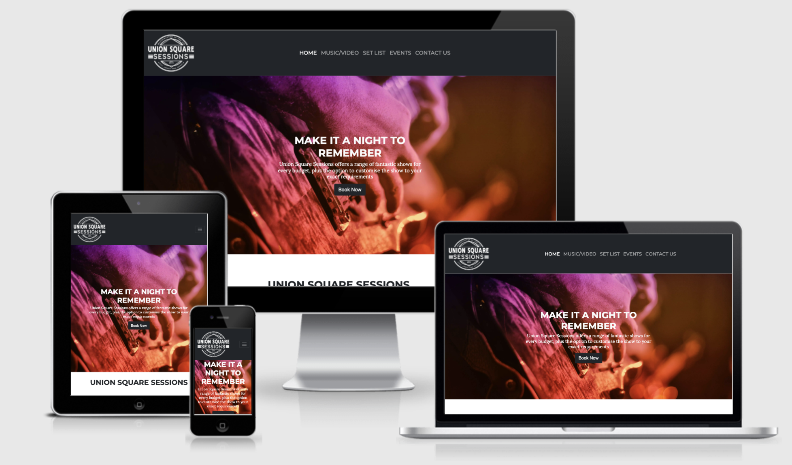
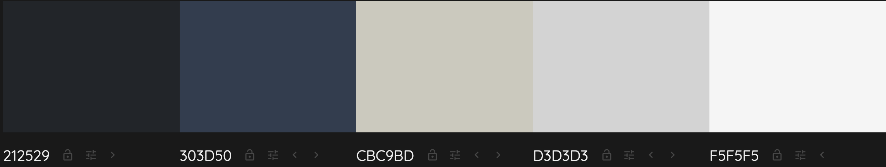

# Union Square Sessions Website

[View live website here....](https://deandodds.github.io/milestoneprojectone/)

This project is the main front-end marketing website for the North East function band Union Sqaure Sessions. The purpose of the website is to promote the band to any potenial customers and encourage users to make enquiries and bookings.

# Table of Contents

1. [User Experience (UX)](#user-experience)
   * [User Stories](#user-stories)
   * [Design](#design)
   * [Wireframes](#wireframes)
2. [Features](#features)   
    * [Future Features](#future-features)  
3. [Technologies Used](#technologies-used)
    * [Langagues Used](#langagues)
    * [Frameworks, Libraries and Programs used](#frameworks)
4. [Deployment](#deployment)
    * [Github pages](#pages)
    * [Making a local clone](#clone)
    * [Forking the GitHub Repository](#fork)
5. [Credis](#credits)
    * [Code](#code)
    * [Content](#content)
    * [Media](#media)
6. [Acknowledgements](#acknowledgements)

## User Experience (UX) 
------

1. ## User Stories 

   * ### First Time Visitor Goals
      * As a first time visitor, I want to be able to understand the main purpose of the website.
      * As a first time vistor, I want to be able to navigate throughout the site and be able to watch, listen and see the bands content easily.
      * As a first time vistor, I want to be able to easily connect with the band on social media.
and 
    * ### Returning Visitor Goalsand 
      * As a returning visitor, I want to be able to book and make an enquiry.
      * As a returning visitor, I want to be able to find out where i can see the band in the future.
      * As a returning visitor, I want to be able to see the band contact information.

    * ### Website Creator goals
      * As a website creator, I want to create a website that works on all platforms.
      * As a website creator, I want to create a good user experience by having a clear navigation system.
      * As a website creator, I want my website load times to be low. I do not want users leaving the site before it has time to load.
      * As a website creator, I want my website to be as accesible as possible in order to be inclusive to all potenial users.

2. ## Design 
   
   * ### Color Scheme
     

   * ### Typography
     *  Montserrat is the main font used for all headers with a sans serif fallback.
     *  Lora is the font used for the main text throughout the website this also as a sans serif fallback. I used this to compliment the montserrat font.

   * ### Imagery 

      ### Home Page
       - 1 x Hero image 
       - 1 x image in About Section 
       - 3 x images in Showcase Feature 
      
      ### Video and Music Page 
       - 4 x images 
      
      ###  Contact Page 
       - 1 x background image

   * ## Videos

      ### Home page 
        - 1 Showreel video created by developer

      ### Video and Music Page
        - 4 x videos 
      
      ### Contact us page
        - 1 x background image 
   
3. ## Wireframes 
    * Home Page wireframes - [View](wireframes/indexwireframe.png)
    * Video/Music wireframes - [View](wireframes/musicvideo.png)
    * Setlist wireframes - [View](wireframes/songlist.png)
    * Events wireframes - [View](wireframes/events.png)
    * Contact Us wireframes - [View](wireframes/contact.png)

## Features 
-----

* Responsive on all device sizes

### Navigation Bar
 * All pages have a collapsible navigation bar, this makes it fully responsive on all devices 

### Footer 
 * All pages have a footer that contains links to social media and contact details for the band. 

### Home Page
 * Callout section with call to action button
 * Responsive About Feature
 * Responsive Showcase Feature with:
    - setlist
    - audio 
    - video 
    - images. 
    All have links for users to discover more content
 * A feature about the bands services with call to action buttons
 * A feature for users to easily make enquiries and get in touch with the band 

### Music/Video Page
 * Music Player 
 * Video Player 

### Setlist Page
 * A list of all songs the band currently play 

### Events Page
*  list of all future events with links to venue directions and tickets 

### Contact us Page Page
* A form for users to make enquiries with the band

### Future Features Page
* Testimonial page 
* Gallery slider on home page
* Newsletter Sign up in footer

## Technologies Used 
-----

### Langagues Used 
* HTML5
* CSS
* JavaScript

### Frameworks, Libraries and Programs used 
1. Bootstrap 5:
   * Used for responsiveness and styling of the website.
2. Slick:
   * Used to create responsive carousel elements on the video/music page of the website.
3. Font Awesome:
   * Used to import icons that used across every page of the website.
4. Google Fonts: 
   * Used to import Montserrat and Lora fonts.
5. Photoshop: 
   * Used to create logo and resize images. 
6. JQuery:
   * Used with both Boostrap 5 and Slick.
8. Gitpod: 
   * Git was used for version control by utilizing the Gitpod terminal to commit to Git and Push to GitHub.
7. GitHub:
   * Used to store the projects code once pushed from Gitpot.
8. Balsamiq:
   * Used to create all wireframes.
9. Soundcloud:
   * Used to enbed a music player with the bands tracks.

## Deployment 
-----

### Github pages 

I Deployed my project to Github pages using the following steps:

1. I logged in to Github and located [repositorys](https://github.com/DeanDodds/milestoneprojectone)
2. I then clicked on settings, this was located just about the green GitPod button.
3. I scrolled down through the settings menu and clicked on the pages section
4. from there, I  went to the source section and under the dropdown menu labeled none I selcted the new-main 
5. I clicked save 
6. after a few minutes the site was live and the link to the published website was generated [link](https://deandodds.github.io/milestoneprojectone/)

### Making a local clone 

You can clone a Github repository to your local computer by following these steps:

1. On GitHub.com, navigate the repository page
2. above the list of files, click on the Code dropdown menu
3. select the download zip file 
4. once the files have downloaded you can extract them form the zip file and run them on your local environment 

You can see more information on making local clones [here](https://docs.github.com/en/repositories/creating-and-managing-repositories/cloning-a-repository#cloning-a-repository-to-github-desktop)

### Forking the GitHub Repository 

Forking a Github repositary allows you to make a copy that you can work on without effecting the original repository. You can fork a repository by:

1. On GitHub.com, navigate the repository page of the repository you would like to fork
2. on the top right hand side of the page locate click fork button 
3. the copy of this resository should now be in your own repositories

## Credits 
------

### Code 
   - From Code Institute - love running website video - footer social links and contact form styling 
   - copywrite postioning from [Stackoverflow](https://stackoverflow.com/questions/1776915/how-can-i-center-an-absolutely-positioned-element-in-a-div)
   - Video player button onclick code from [Stackoverflow](https://stackoverflow.com/questions/46817842/using-the-same-div-to-show-different-videos-on-click)
   - Slick slider button fix [Stackoverflow](https://stackoverflow.com/questions/46817842/using-the-same-div-to-show-different-videos-on-click))
   - [Bootstrap5](https://getbootstrap.com/docs/5.0/getting-started/introduction/) library used throughout 
   - [slick](https://kenwheeler.github.io/slick/) library used for video player image slider 
    

### Content 
   - All content written by Developer

### Media 

### Images
   - 1 x Hero image - Photo by Suvan Chowdhury from Pexels -  https://www.pexels.com/photo/person-playing-string-instruments-144428/?utm_content=attributionCopyText&utm_medium=referral&utm_source=pexels 
   - Photo by MarcAntoine Dépelteauh from StockSnap -https://stocksnap.io/photo/concert-stage-P7JJ4LKNK8
   - Photo by Josh Sorenson from Pexels - https://images.pexels.com/photos/995301/pexels-photo-995301.jpeg?auto=compress&cs=tinysrgb&dpr=2&h=750&w=1260
   - Photo by picjumbo.com from Pexels - https://images.pexels.com/photos/196652/pexels-photo-196652.jpeg?auto=compress&cs=tinysrgb&dpr=2&h=750&w=1260
   - Photo by freestock.org from Pexels - https://images.pexels.com/photos/96380/pexels-photo-96380.jpeg?auto=compress&cs=tinysrgb&w=1260&h=750&dpr=2 
   - Photo by Vishnu R Nair from Pexels - https://images.pexels.com/photos/1105666/pexels-photo-1105666.jpeg?auto=compress&cs=tinysrgb&w=1260&h=750&dpr=2 

### Vidoes
   - Video by Cottonbro from Pexels - https://www.pexels.com/video/a-woman-dancing-expressively-with-a-glass-of-wine-on-hand-3188954/ 

## Acknowledgements 
   - Chris Quinn - My Mentor for continuous helpful feedback and advice.
   - The Code Institute Slack Community 

[Testing link](TESTING.md)