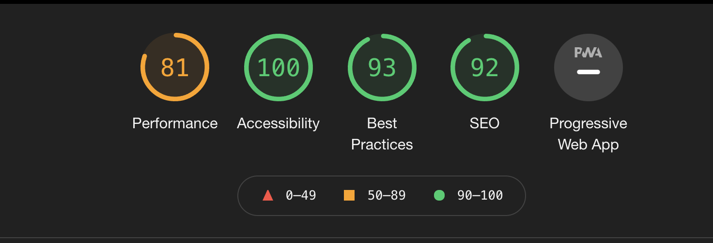
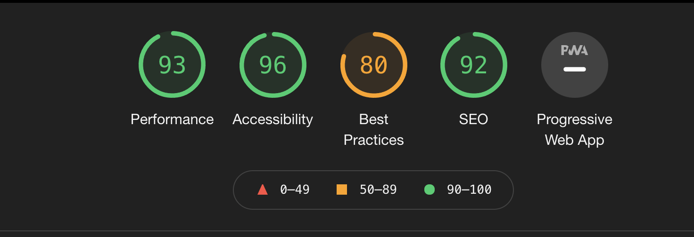
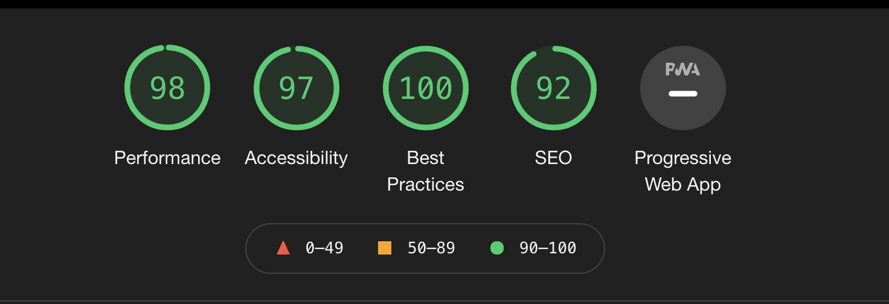
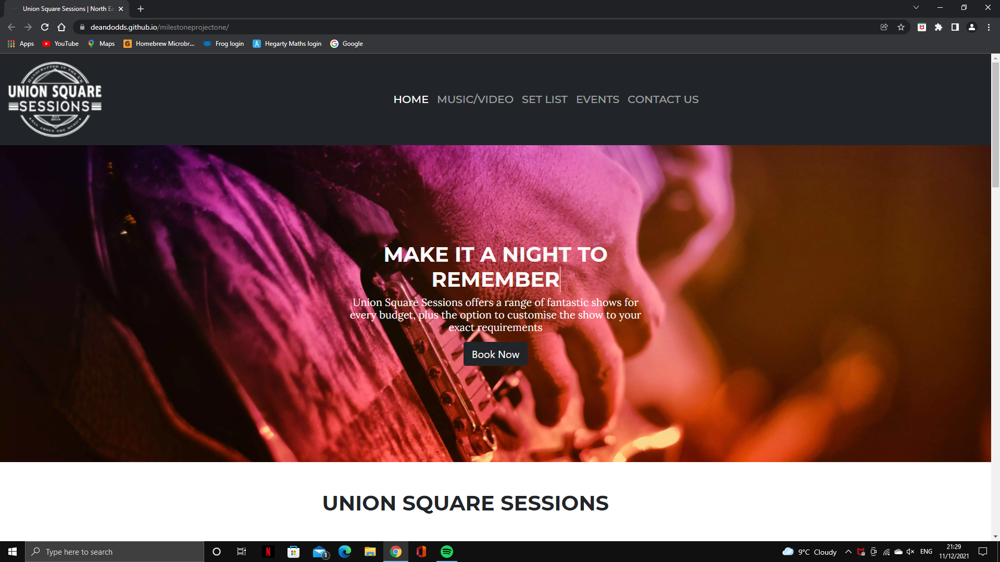

# Testing
-----
# Table of Contents

1. [Validation](#validation)
2. [Testing User Stories from User Experience (UX) Section](#user)
3. [Lighthouse Reports](#lighthouse )
* [Further Testing](#ftesting)
* [Known Bugs](#bugs)

## Validation 
I used the W3C Markup and CSS Validator Service to ensure there was no syntax errors all my pages.

W3C Mark up Validator
 * Home Page - [View](https://validator.w3.org/nu/?doc=https%3A%2F%2Fdeandodds.github.io%2Fmilestoneprojectone%2Findex.html)
 * Music/Video - [View](https://validator.w3.org/nu/?doc=https%3A%2F%2Fdeandodds.github.io%2Fmilestoneprojectone%2Fmedia.html)
 * Setlist - [View](https://validator.w3.org/nu/?doc=https%3A%2F%2Fdeandodds.github.io%2Fmilestoneprojectone%2Fsetlist.html) 
 * Events - [View](https://validator.w3.org/nu/?doc=https%3A%2F%2Fdeandodds.github.io%2Fmilestoneprojectone%2Fevents.html)
 * Contact Us - [View](https://validator.w3.org/nu/?doc=https%3A%2F%2Fdeandodds.github.io%2Fmilestoneprojectone%2Fcontacts.html)

W3C CSS Validator
 * [View](https://jigsaw.w3.org/css-validator/validator?uri=https%3A%2F%2Fdeandodds.github.io%2Fmilestoneprojectone%2F&profile=css3svg&usermedium=all&warning=1&vextwarning=&lang=en)

## Testing User Stories from User Experience (UX) Section 

   * ### First Time Visitor Goals
      1. As a first time visitor, I want to be able to understand the main purpose of the website.
       - When entering the site users can clearly see the navigation bar and the purpose of the site is very clear
       - The users have clear options. Users can use the call to action button to make a booking or scroll untill they see the content that intrests them

      2. As a first time vistor, i want to be able to navigate through out the site and beable to watch, listern and see the bands content easily.
       - Navigtion to content is clear. The links to this content or in the navigation bar and links from the home page
   
      3.  As a first time vistor, i want to be able to beable to easily connect with the band on social media.
       -  Links to this content is in the footer on every page  

 * ### Returning Visitor Goals
      1. As a returning time visitor, i want to be able to beable to book make an enquiry.
       - Users have lots of diffent options to get in touch with the band throughout the home page

      2. As a returning time visitor, i want to be able to beable to find out where i can see the band in the future
       - There are clear links in the navigation to a upto date list of events featuring the band 
        
      3. As a returning time visitor, i want to be able to beable to see the band contact information.
      - the bands contact details are displayed in the footer of every page. 
 
 * ### * ### Website Creator goals
      1. As a website Creator, I want to create a website that works on all platforms.
      - Website runs on all devices tested.

      2. As a website Creator, I want to create a good user experience by having a clear navigation system.
      - Navigation system worked well during user testing 

      3. As a website Creator, I want to my website load times to be low. I do not want users leaving the site before it has time to load.
      - Video elements running a little showly at present. i am consider hosting videos on and external webiste such as youtube to speed up loading.

      4. As a website Creator, I want to my website to be as accesible as possible so all users are able to have use to it.
      - Webpages all pass lighthouse accesibility testing.

## lighthouse testing. 

All my pages have went through google dev tools lighthouse analylis and scored on
      * Performance 
      * Accesibility
      * Best Practices
      * Search Engine Optimization (SEO)

  ### Home Page

  

  ### Music/Video Page

  

  ### Set List Page

  

  ### Events Page

  

  ### Contacts Page 

  

## Further Testing 

I have tested my project on a varity of browsers such as:
  * Google Chrome 

  

  * Firefox 
  
  * Safari

  

I have also tested it on arrange of devices such as
  * Iphone 6
  * Iphone S
  * laptop 
  * Desktop
  * Huawei T10 tablet

I also used the chrome developer tools to test responsiveness on different device simulations.

I asked my friends and family to visit the website and report any problems the encounter 

I have done a large amount of testing on all pages to ensure all:
  * links 
  * videos 
  * buttons  
are working correctly and fixed and broken links 

## Known Bugs 
* On older devices home page callout section spills over its container and the background image is too zoomed in 
* On older devices home page showcase card links need extra padding
* on older devices contact page enquiry form overflows the container.